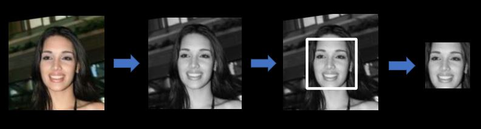
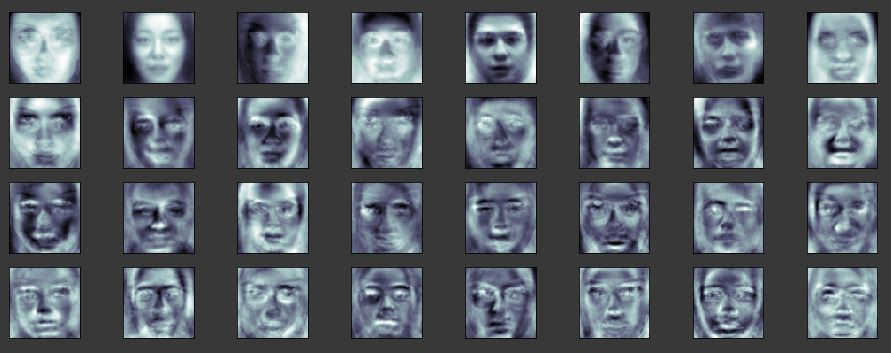
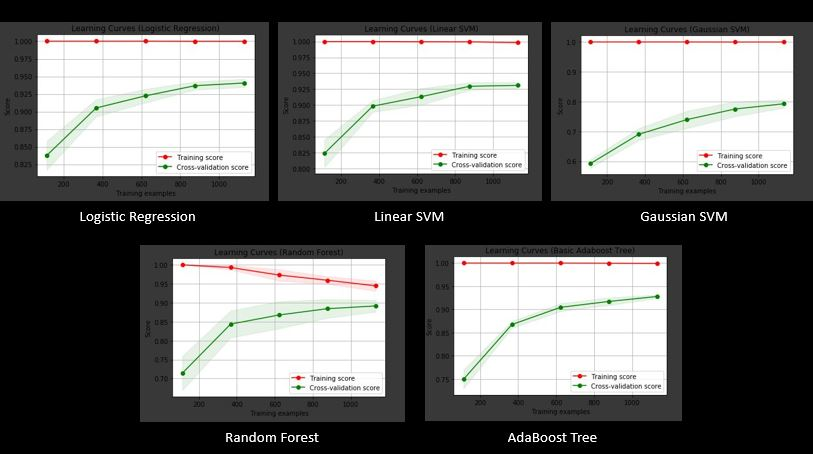

# Gender Classification using Machine Learning
### And testing it on various classifiers

The aim of the project is to choose the best gender classification model between -
* Logistic Regression
* Linear SVM
* Gaussian SVM
* Random Forest 
* Adaptive Boost classifiers. 

At the end we will also see how well each chosen model works.

## Steps involved in the process:
1. Data Processing
2. Dimensionality Reduction
3. Fit the default Classifier
4. Tune Hyperparameters using Grid Search
5. Estimating the Best Parameters and the Best Scores
6. Plot Learning Curve

## A. DATA PRE-PROCESSING -
1. Import the Dataset
  * Import and separate data for both the genders.
2. Process the Data
  * Convert to Gray
  * Detect faces using HAAR Cascade
  * Crop the face
  * Resize Image
3. Creating DataFrame 
  * Label data and save as a dataframe

## B. Working with the Classifier
1. Creating Pipeline for data
 * Dimensionality reduction using PCA.
 * Converting features to scaler
2. Fit the Classifier
 * Fit the model with default parameters
 * Check for the default accuracy
3. Tune Hyperparameters
 * Run an exhaustive Grid Search for the best scores
 * Check for the corresponding parameters
 

Dimensionality Reduced from 6400 features to only 300 components

### Best Scores obtained from the subsequent classifiers:
Classifier | Best Score | Parameters Tuned
------------ | ------------- | -------------
Logistic Regression | 0.951912 | C , n_components
Linear SVM | 0.945475 | C , n_components
Gaussian SVM | 0.970087 | C , gamma
Random Forest | 0.914048 | n_estimators , max_depth
AdaBoost with Decision tree | 0.936766 | n_estimators , learning _rate

Gaussian SVM clearly shows the highest accuracy 
### Analyzing the results by plotting the Learning Curve
To configure the perfect bias-variance trade-off for the specific algorithm

## Conclusion - 
Altogether, Logistic Regression does a decently good job in predicting the scores and has a relatively better Learning curve.

